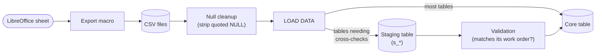

# aluminadb

Data model + ETL (extract, transform, load) pipeline for production management of an aluminum profile manufacturing plant

## What this is

This repo contains code for what was a self-made manufacturing execution system

It represents the process flow in an aluminum profile (manufacturing) plant, where 2 main processes took place: extrusion and (electrostatic) painting|coating

More information on the industrial process [here](./docs/industrial_process.md)

The aim was to reduce the inefficiencies of manual data processing: to be able to track production, deliver orders and produce reports with minimal delay

It ran in daily production from late 2018 to mid 2020 (about a year and a half), tracking orders for 8 clients across hundreds of extrusion and painting runs


*Fun fact: `alumina` (aka Aluminum Oxide, Al2O3) is what covers raw aluminum: since it is very reactive with atmospheric oxygen in its pure form, a thin oxide layer forms on exposed aluminum surfaces almost instantly, which protects the metal from further oxidation.*

## Tech stack

It was written in Bash and MySQL, originally running against a MySQL server on a Linux machine

It can now be run and tested locally through the included Docker Compose service (MySQL in a container)

## How it works



The system lives mainly in a (My)SQL database, accessed through queries (on views, for the most part)

## Quick start

```bash
docker compose up -d        # Launch MySQL inside a container
bash scripts/do.sh          # Set up the schema
bash scripts/doloaddata.sh  # Load the CSV data
```

## Schema

96 tables, ~180 foreign keys, 29 views

See:
- [Diagrams](./docs/schema/diagrams.md)
- [Tables](./docs/schema/tables.md)

## Evolution

It was built incrementally and iteratively:

- It started with the design of the production log sheets (filled by operators on the factory floor)
- Then the logs were transcribed into ~~Excel~~ LibreOffice Calc sheets

(There was no production management system in place yet: this was a brand new industrial plant, the company had already invested heavily in equipment, but the data side of the operation was missing. That's where this started)

After a while, complexity grew: more products and dies (tooling used to produce the profiles), more customers, more requests, more paint colors

So a feedback loop between building a data model and reshaping the log and Excel sheets started to take place

It kept evolving, with rough edges and a long to-do list of pending ideas, built alongside the actual work of managing production, people, customers and other shareholders

