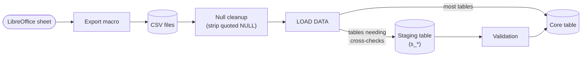

# aluminadb

Data model + ETL (extract, transform, load) pipeline for production management of an aluminum profile manufacturing plant.

## What this is

This repo contains code for a self-made system built to replace manual spreadsheet processing in an aluminum profile (manufacturing) plant, where 2 main processes took place: extrusion and (electrostatic) painting|coating.

It was built to better track production, deliver orders and produce reports with minimal delay.

It ran in daily production from late 2018 to mid 2020 (about a year and a half), until I left the company.

*Fun fact: `alumina` (aka Aluminum Oxide, Al2O3) is what covers raw aluminum: since it is very reactive with atmospheric oxygen in its pure form, a thin oxide layer forms on exposed aluminum surfaces almost instantly, which protects the metal from further oxidation.*

More information on the industrial process [here](./docs/industrial_process.md).

## Quick start

```bash
docker compose up -d
bash src/bash/do.sh          # Set up the schema
bash src/bash/doloaddata.sh  # Load the CSV data
```

## Tech stack

It was written in Bash and MySQL, originally running against a MySQL server on a Linux machine.

**Why?** *Bash and MySQL were what I already knew at the time, not an architectural choice I'd defend today.*

It can now be run and tested locally through the included Docker Compose (v2) service (MySQL 8.0 in a container). Bash (>= 4) is used for setting up the schema and loading data into the database.

## How it works

The system is accessed directly via a MySQL client, querying views for the most part



The diagram above shouldn't imply heavy validation, though: there wasn't much. Most mismatches (a missing key, for example) simply failed to load, MySQL rejected the row, the source spreadsheet was fixed, and it got reloaded. The staging-table step (`s_*` to validate to core) is the one deliberate exception, for the handful of tables where a row needed a real cross-check (does it match its work order?) before being trusted, not just a valid foreign key.


## Schema

79 tables, 126 foreign keys, 28 views: 877 order line items and roughly 20K rows loaded in total, tracking hundreds of extrusion and painting runs.

See:
- [Diagrams](./docs/schema/diagrams.md)
- [Tables](./docs/schema/tables.md)

## Evolution

It was built incrementally and iteratively:

- It started with the design of the production log sheets (filled by operators on the factory floor)
- Then the logs were transcribed into ~~Excel~~ LibreOffice Calc sheets

*There was no production management system in place yet: this was a brand new industrial plant, the company had already invested heavily in equipment, but the data side of the operation was missing. That's where this started*

After a while, complexity grew: more products and dies (tooling used to produce the profiles), more customers, more requests, more paint colors.

So a feedback loop between building a data model and reshaping the log and Calc sheets started to take place.

It kept evolving, with rough edges and a long to-do list of pending ideas, built alongside the actual work of managing production, people, customers and other shareholders.

## License

MIT, see [LICENSE](./LICENSE).
