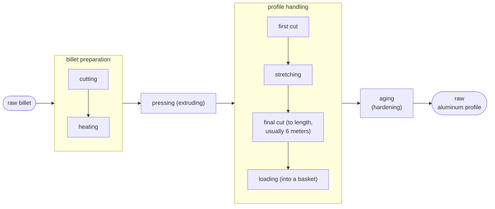
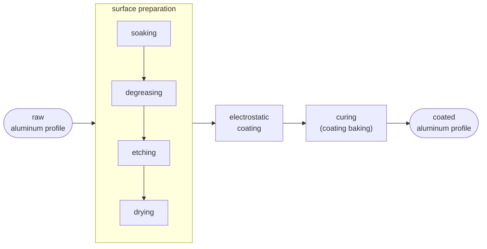

# aluminadb

data model + ETL pipeline for production management of an aluminum profile manufacturing plant

## what this is

this repo contains code for what was a self-made manufacturing execution system

it represents the process flow in an aluminum profile (manufacturing) plant, where 2 main processes took place: extrusion and (electrostatic) painting|coating

the aim was to reduce the inefficiencies of manual data processing: to be able to track production, deliver orders and produce reports with minimal delay

## tech stack

it was written in bash and mysql

## how it works

libreoffice sheets
-> csv files
-> loading into database (bash+mysql scripts)

the system lives mainly in a (my)sql database, accessed through queries (on views, for the most part)

## evolution

it was built incrementally and iteratively:

- it started with the design of the log sheets, to be filled by operators on the factory floor,

- started with the log sheets that were filled on the factory floor by operators (this was the first step in the data system)
- the records were transcribed into excel

after a while, complexity grew: more products and dies (tooling used to produce the profiles), more customers, more requests, more paint colors

so a feedback loop between building a data model and reshaping the log and excel sheets started to take place

and it kept evolving, with rough edges and a long to-do list of pending ideas

while the actual work of managing production, people, customers and other shareholders took place in parallel

### unfinished parts

there were several ideas not implemented, resulting in empty tables or disconnected mysql triggers (removed from the repo)

a more user friendly system was also attempted (in php, without much prior experience) but it was never finished: 

## overview of the industrial processes

The end products are aluminum profiles (with or without paint|coating).

each going through multiple processes, under specific ranges of temperature, pressure, timing and other parameters
- for extrusion: heating of raw aluminum (billet), pressing (the extrusion itself), then profile cut, stretch and aging|hardening
- for painting: cleanup and surface preparation, then coating and baking|curing

to achieve this and serve customers, product requests and inventory (of raw materials, supplies, tooling) were also tracked

### the main 2 processes

#### extrusion

the raw material is the billet: a solid aluminum cylinder, pressed against a die, to produce a desired profile shape

#### painting|coating

here the raw materials are the uncoated aluminum profiles (already aged), the chemicals used for the baths before painting, and the electrostatic paint powder

### other processes

there were side processes that also needed to be tracked, for effective production management, namely

- dies

(what the billet flows through and gives the profile its shape)

    dies are what give the profile its shape. extrusion takes place when the billet (already cut and heated) is pressed against the die set (it consists of more parts actually, to ensure structural stability; ultimately, to be able to withstand the extrusion conditions without breaking): the die itself has a hole (roughly) in the shape of the profile

    there are two types of profiles (hence, two types of die sets):
    - solid (with just one outer surface)
    - hollow (with an outer surface and one or more inner surfaces)

    dies are very sensitive, and die preparation can mark the difference between a productive and a lost day of production

    they need to be cleaned, brushed and polished on the inside with care and, more importantly, they have a limit on how much they can extrude before needing another hardening: the "nitration" process

    all of this needs to be tracked carefully (properly logged and inventoried, keeping a "life log" of each die) to ensure the longest possible lifespan of the die tooling while maximizing production

- pre-coating baths 

    
(that take place before the electrostatic coating process)
    

    after extrusion and before the painting process takes place, the "bath" pool conditions are carefully tracked: this also marks the difference between a good quality, well adhering coating and one that peels off or comes out looking rough or with other defects

- customer orders and profile inventory 

    
(needless to say)

    the existing profile inventory needs to be tracked so that production can be prioritized, based on the unfulfilled orders and available dies

    requests are marked as completed once they are packaged and delivered

## schema

see the [diagrams](./docs/diagrams.md)