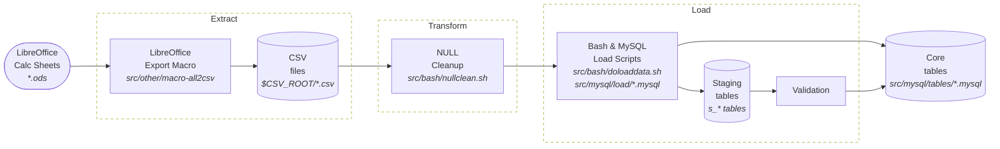

# How it works

The rest of this doc walks through that picture in order: what data feeds it in ([Raw
data](#raw-data)), then each stage in detail ([Data pipeline](#data-pipeline)), then what happens
once it's loaded ([Usage](#usage)). The schema itself (`tables/*.mysql`, `values/*.mysql`) is set
up separately by `src/bash/do.sh`, before any of this runs — see [Load](#load) below.

## Raw data

Every CSV in `$CSV_ROOT` traces back to a LibreOffice Calc file (open source spreadsheet app),
exported sheet by sheet by `src/other/macro-all2csv`: a workbook saved as `x.ods` produces one
`x.<sheet_name>.csv` per sheet. For example, the `op_extrusion` workbook's `generacion` sheet
exports to `op_extrusion.generacion.csv`; a workbook with only one sheet just exports as `x.csv`.

The table below lists every workbook the pipeline actually loads data from, and which of its
sheets end up in the database (to get the full CSV filename, combine the workbook name with a
sheet name from the same row, e.g. `matrices` + `nitruracion` → `matrices.nitruracion.csv`).

| Description | LibreOffice Calc file (raw data) | Sheets it loads (extracted data) |
|---|---|---|
| Profile (product) catalog | `perfiles` | *(single sheet)* |
| Die catalog and its logs (corrections, hardness, nitriding) | `matrices` | `matrices`, `correcciones`, `mediciondureza`, `nitruracion`, `stock_matrices` |
| Aluminum billet supply | `insumos_tocho0` | `cargas_aluminio`, `cargas_aluminio_packinglist`, `tocho0` |
| Billet-cutting log | `cortetochos` | `cortetochos` |
| Extrusion production orders | `op_extrusion` | `generacion`, `op_extrusion`, `entrada`, `matriz`, `objetivo`, `parapedido`, `planeamiento` |
| The press-run log | `extrusion` | `extrusion`, `corte`, `matriz`, `muestra_culote`, `muestra_perfil`, `produccion`, `stats`, `tochos` |
| Aging (hardening) batches and baskets | `envejecimiento` | `envejecimiento`, `canastos`, `contenido` |
| Painting production orders | `op_pintura` | `generacion`, `op_pintura`, `parapedido`, `planeamiento` |
| The painting run log | `pintura` | *(single sheet)* |
| Paint supplies: loads, batches, boxes, exits | `insumos_pinturas` | `cargas_pinturas`, `cargas_pinturas_detalle`, `colores_codigos`, `pinturas`, `salidas` |
| Raw-profile stock movements | `d_stock_perfiles` | *(single sheet)* |
| Customer orders and deliveries | `pedidos` | `generacion`, `pedidos`, `entregas` |
| Worker/personnel roster | `rrhh` | *(single sheet)* |

## Data pipeline

For data to reach a core table, it goes through the Extract, Transform and Load stages shown in
the diagram above.

### Extract

`src/other/macro-all2csv` is a LibreOffice Basic macro that runs inside the source workbook and
exports every sheet to a CSV named after that sheet.

### Transform

`src/bash/nullclean.sh` rewrites quoted `"NULL"`/`'NULL'` literals in a CSV into bare, unquoted
`NULL`, so `LOAD DATA` treats them as real SQL `NULL` instead of the four-letter string `"NULL"`.
`src/bash/doloaddata.sh` runs it, per data group, right before that group's CSVs load.

### Load

`src/bash/do.sh` sets up the schema first (tables, then values, then views, then procedures) —
this is a one-time/occasional step, run separately, before any CSV data exists. `doloaddata.sh`
then loads the CSVs themselves, one data group at a time, through `LOAD DATA LOCAL INFILE`
statements defined in `src/mysql/load/*.mysql`.

#### Validation

There wasn't a sophisticated validation mechanism. For nearly every table, "validation" just means
the database's own constraints: foreign keys, `CHECK`, `NOT NULL`, `UNIQUE`. When a row breaks one,
`LOAD DATA` prints an error naming which constraint failed and where. The row then gets corrected
at the source — in the LibreOffice workbook — re-exported, and the load re-run until it goes
through clean. Nothing here is automatic; a person reads the error and fixes the sheet by hand.

A small number of tables need a check a foreign key can't express: not just "does this key exist,"
but "does this row's data actually agree with the row it points at." For example, an `extrusion`
row references a production order by `nro_op`/`nro_subop`, but a valid order number isn't enough
on its own — the profile code has to match what that order says to produce, and a foreign key can
only confirm the order exists, not that it matches.

For these, the CSV loads into a staging table first (prefixed `s_`, e.g. `s_extrusion`, mirroring
the real table's structure), and a single `INSERT ... SELECT ... WHERE <condition>` right after
forwards only the rows that pass into the real table, comparing each staged row against whatever
it needs to agree with. Rows that don't match are reported the same way a broken constraint would
be, so they can be fixed at the source and reloaded through the same manual loop described above.

## Usage

There's no application layer sitting on top of this: once the data is loaded, it's queried
directly using a MySQL client.

Raw [tables](./schema/tables.md) are the source of truth, but what's more often queried in their
place are [views](./schema/views.md) and, for a few die-related lookups,
[procedures](./schema/procedures.md) (`CALL procedure(...)`, called by hand). For more detail on
what was actually possible, see [capabilities.md](./capabilities.md).

## What's here is what still works

This ran as a real, evolving production system. It originally had, at various points, more tables
and more validation checks than what's in this repo now. Pieces that were abandoned or unfinished
are removed for simplicity.
