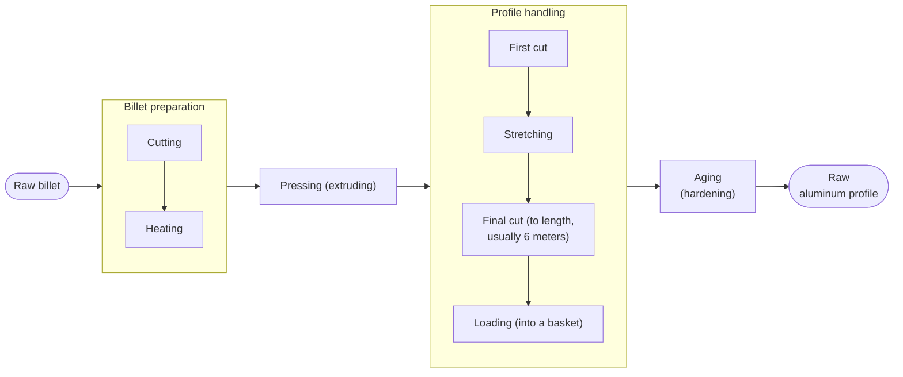
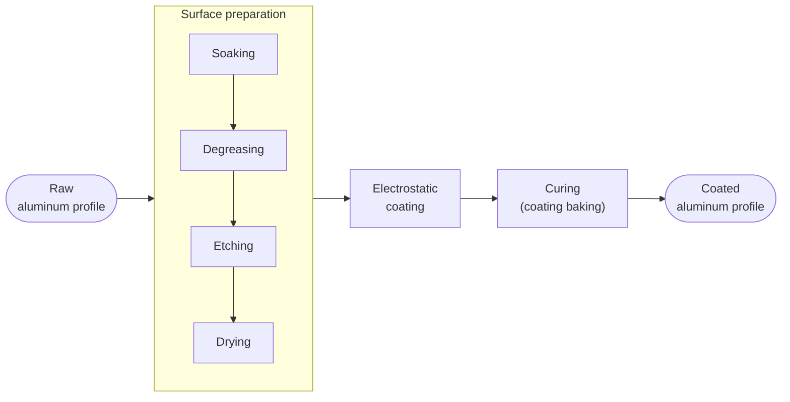

# Overview of the industrial processes

The end products are aluminum profiles, either raw or coated (painted).

To produce them, multiple processes take place, under specific ranges of temperature, pressure, timing and other parameters.

The main ones:
- **Extrusion**: heating of raw aluminum (billet), pressing (the extrusion itself), then profile cut, stretch and aging (hardening)
- **Painting|Coating**: cleanup and surface preparation, then coating and curing

To achieve this and serve customers, product requests and inventory (of raw materials, supplies, tooling) were also tracked

## The main processes

### Extrusion

The raw material is the billet: a solid aluminum cylinder, pressed against a die, to produce a desired profile shape

### Painting|Coating

Here the raw materials are the uncoated aluminum profiles (already aged), the chemicals used for the baths before painting, and the electrostatic paint powder

## Other processes

There were side processes that also needed to be tracked, for effective production management, namely

- Dies 

    
(What the billet flows through and gives the profile its shape)

    Dies are what give the profile its shape. Extrusion takes place when the billet (already cut and heated) is pressed against the die set (it consists of more parts actually, to ensure structural stability; ultimately, to be able to withstand the extrusion conditions without breaking): the die itself has a hole (roughly) in the shape of the profile

    There are two types of profiles (hence, two types of die-sets):
    - Solid (with just one outer surface)
    - Hollow (with an outer surface and one or more inner surfaces)

    Dies are very sensitive, and die preparation can mark the difference between a productive and a lost day of production

    They need to be cleaned, brushed and polished on the inside with care and, more importantly, they have a limit on how much they can extrude before needing another hardening: the "nitriding" process

    All of this needs to be tracked carefully (properly logged and inventoried, keeping a "life log" of each die) to ensure the longest possible lifespan of the die tooling while maximizing production

- Pre-coating baths 

    
(That take place before the electrostatic coating process)

    After extrusion and before the painting process takes place, the "bath" pool conditions are carefully tracked: this also marks the difference between a good quality, well adhering coating and one that peels off or comes out looking rough or with other defects

- Customer orders and profile inventory 

    
(...Needless to say...)

    The existing profile inventory needs to be tracked so that production can be prioritized, based on the unfulfilled orders and available dies

    Requests are marked as completed once they are packaged and delivered

