# aluminadb — entity-relationship diagrams, by group

Same 65 working tables and 104 foreign-key relationships as [erd_all.md](./erd_all.md) /
[erd_all_grouped.md](./erd_all_grouped.md), split into one diagram per group instead of one
unified diagram — easier to read closely, at the cost of not showing the whole schema at once.
Groups and table lists match [tables.md](./tables.md) exactly, in the same order.

Cardinalities and relationship labels come from the same schema-verified data as
[erd_all.md](./erd_all.md) (columns, keys and nullability pulled from `information_schema`, not
hand-transcribed). A table pulled in only because another group's table references it (or is
referenced by it) shows up here as a stub with just its primary key — full detail on that table
lives in its own group's section.

## People (workers & customers)

4 tables, 19 external references.

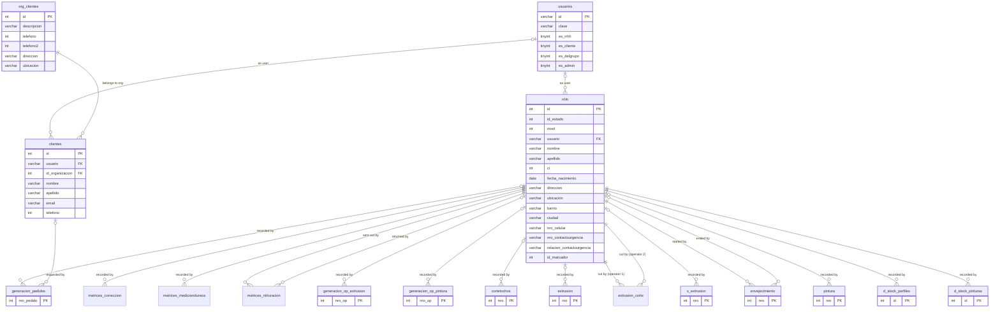

## Orders

6 tables, 10 external references.

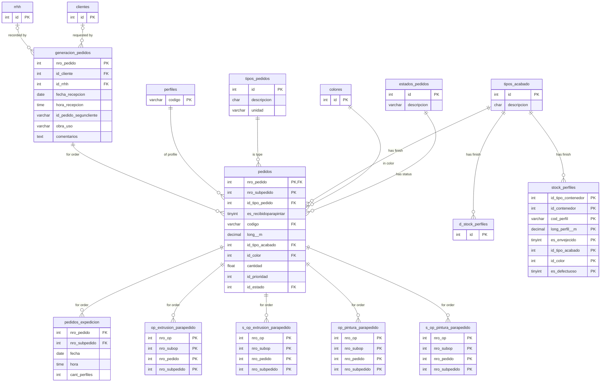

## Profile types and stock

6 tables, 17 external references.

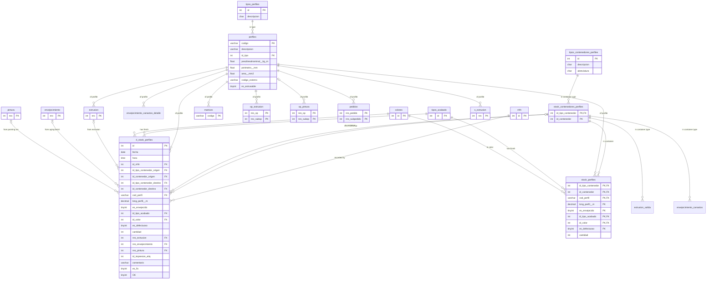

## Extrusion Materials

3 tables, 2 external references.

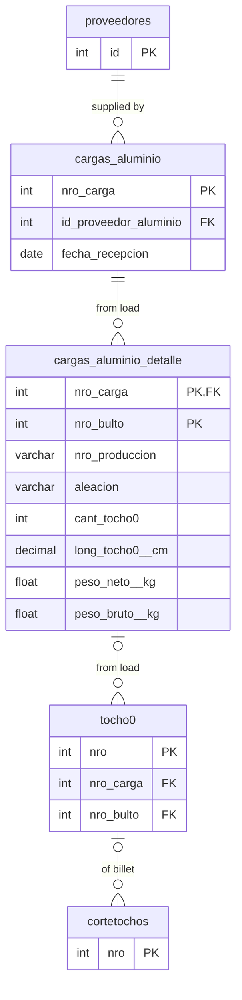

## Billets & cutting

1 table, 3 external references.

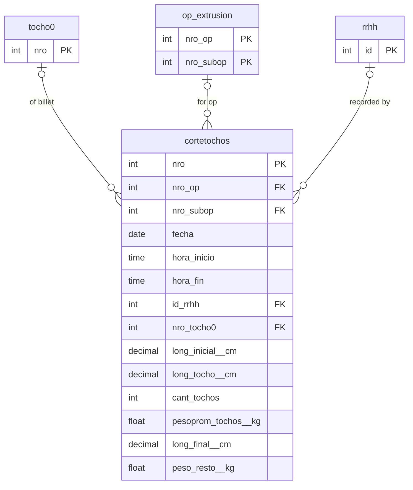

## Dies

7 tables, 9 external references.

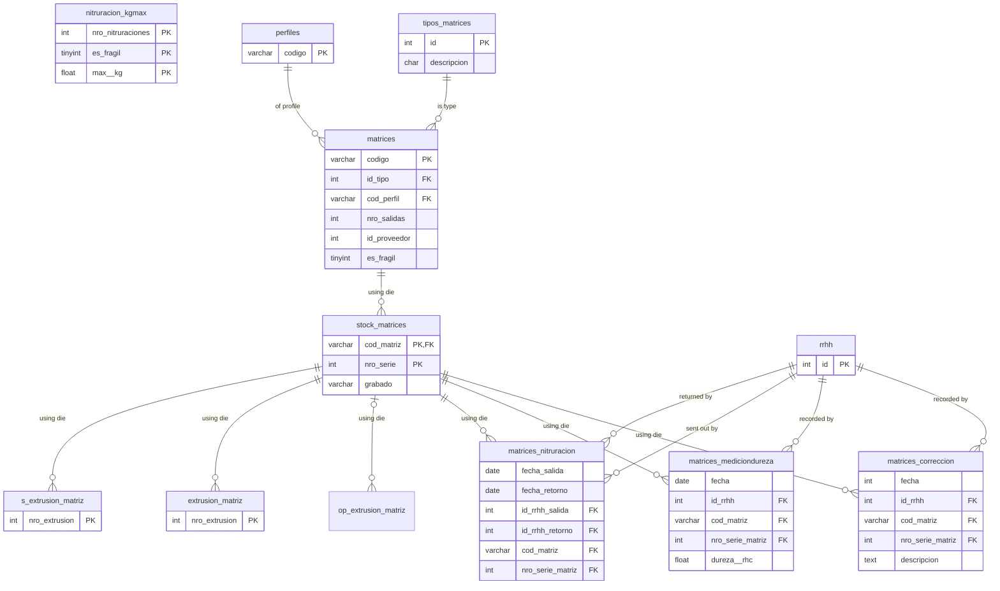

## Extrusion orders

9 tables, 11 external references.

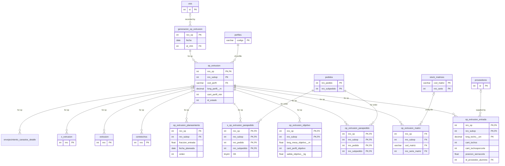

## Extrusion production

10 tables, 12 external references.

```mermaid
erDiagram
    extrusion {
        int nro PK
        date fecha
        time hora_inicio
        time hora_fin
        int id_rrhh FK
        int nro_op FK
        int nro_subop FK
        varchar cod_perfil FK
    }
    extrusion_corte {
        int nro_extrusion FK
        date fecha
        time hora_inicio
        time hora_fin
        int id_rrhh_1 FK
        int id_rrhh_2 FK
    }
    extrusion_entrada {
        int nro_extrusion PK,FK
        decimal long_tocho__cm PK
        float peso_unit__kg
        int cantidad
    }
    extrusion_matriz {
        int nro_extrusion PK,FK
        varchar cod_matriz FK
        int nro_serie_matriz FK
    }
    extrusion_muestraculote {
        int nro_extrusion FK
        int cant_culote
        float peso_total__kg
    }
    extrusion_muestraperfil {
        int nro_extrusion FK
        int nro_salida
        decimal long_muestraperfil__cm
        float peso_muestra__g
    }
    extrusion_salida {
        int nro_extrusion FK
        decimal long_perfil__m
        int cantidad
        int id_tipo_contenedor FK
        int id_contenedor FK
    }
    extrusion_stats {
        int nro_extrusion PK,FK
        tinyint es_prueba
        float pos_sierracorte
        float long_mesa__m
        float temp_tocho_entrada__c
        float temp_perfil_salida__c
        tinyint sugiere_correccion_matriz
        tinyint extrusion_detenida
        text comentarios
    }
    s_extrusion {
        int nro PK
        date fecha
        time hora_inicio
        time hora_fin
        int id_rrhh FK
        int nro_op FK
        int nro_subop FK
        varchar cod_perfil FK
        tinyint OK
    }
    s_extrusion_matriz {
        int nro_extrusion PK,FK
        varchar cod_matriz FK
        int nro_serie_matriz FK
        tinyint OK
    }
    d_stock_perfiles {
        int id PK
    }
    op_extrusion {
        int nro_op PK
        int nro_subop PK
    }
    perfiles {
        varchar codigo PK
    }
    rrhh {
        int id PK
    }
    stock_contenedores_perfiles {
        int id_tipo_contenedor PK
        int id_contenedor PK
    }
    stock_matrices {
        varchar cod_matriz PK
        int nro_serie PK
    }

    perfiles ||--o{ extrusion : "of profile"
    op_extrusion |o--o{ extrusion : "for op"
    rrhh |o--o{ extrusion : "recorded by"
    extrusion ||--o{ extrusion_corte : "from extrusion"
    rrhh ||--o{ extrusion_corte : "cut by (operator 1)"
    rrhh ||--o{ extrusion_corte : "cut by (operator 2)"
    extrusion ||--o{ extrusion_entrada : "from extrusion"
    extrusion ||--o{ extrusion_matriz : "from extrusion"
    stock_matrices ||--o{ extrusion_matriz : "using die"
    extrusion ||--o{ extrusion_muestraculote : "from extrusion"
    extrusion ||--o{ extrusion_muestraperfil : "from extrusion"
    extrusion ||--o{ extrusion_salida : "from extrusion"
    stock_contenedores_perfiles ||--o{ extrusion_salida : "in container type"
    extrusion ||--o{ extrusion_stats : "from extrusion"
    perfiles ||--o{ s_extrusion : "of profile"
    op_extrusion |o--o{ s_extrusion : "for op"
    rrhh |o--o{ s_extrusion : "recorded by"
    extrusion ||--o{ s_extrusion_matriz : "from extrusion"
    stock_matrices ||--o{ s_extrusion_matriz : "using die"
    extrusion |o--o{ d_stock_perfiles : "from extrusion"
```

## Aging

3 tables, 6 external references.

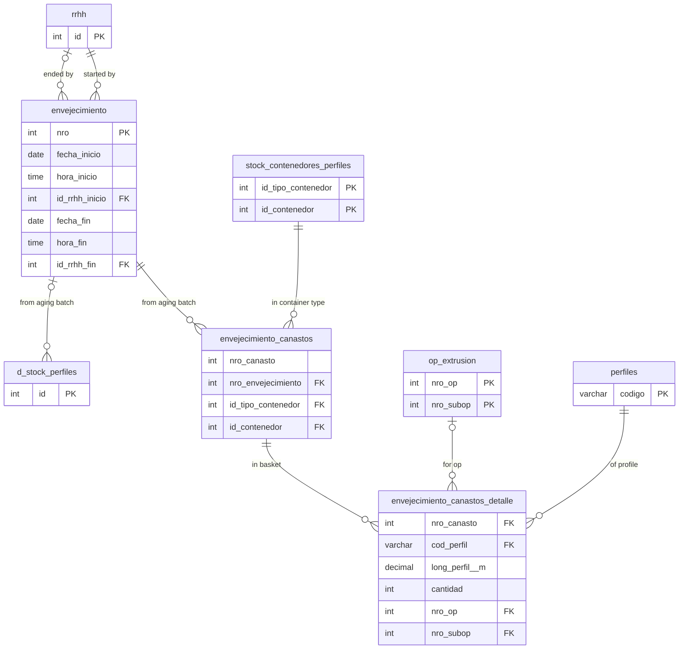

## Paint Materials and Supplies

10 tables, 9 external references.

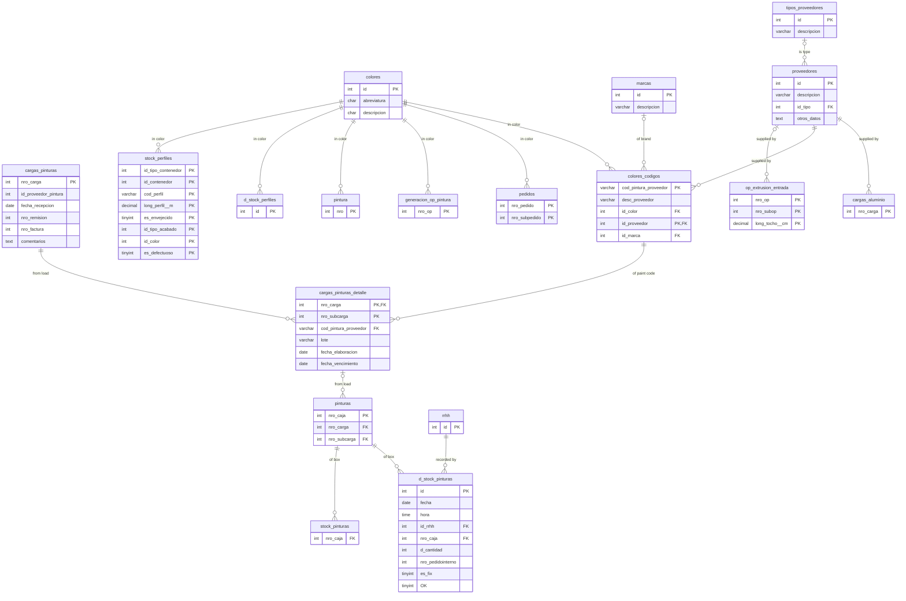

## Painting orders

6 tables, 5 external references.

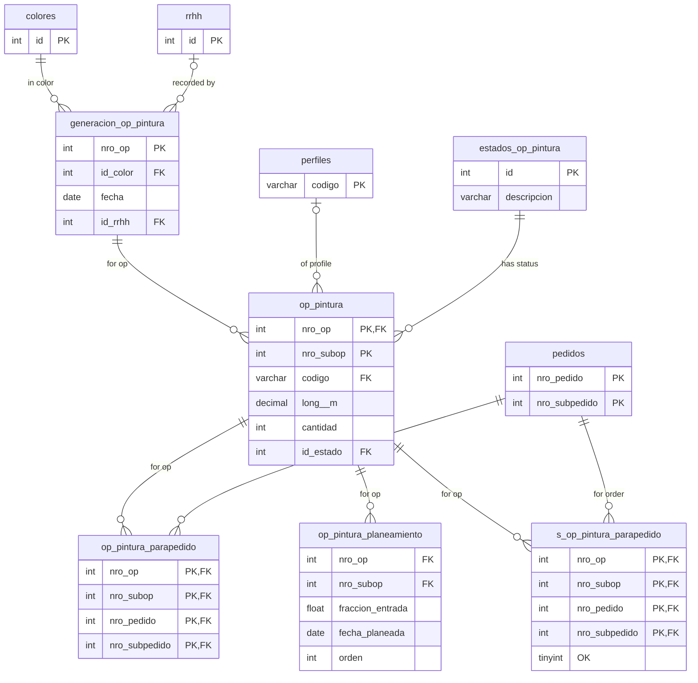

## Painting production

2 tables, 5 external references.

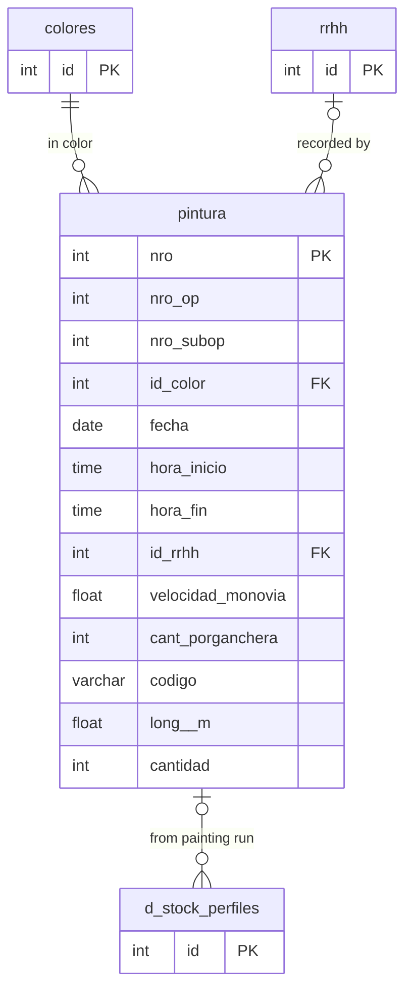
