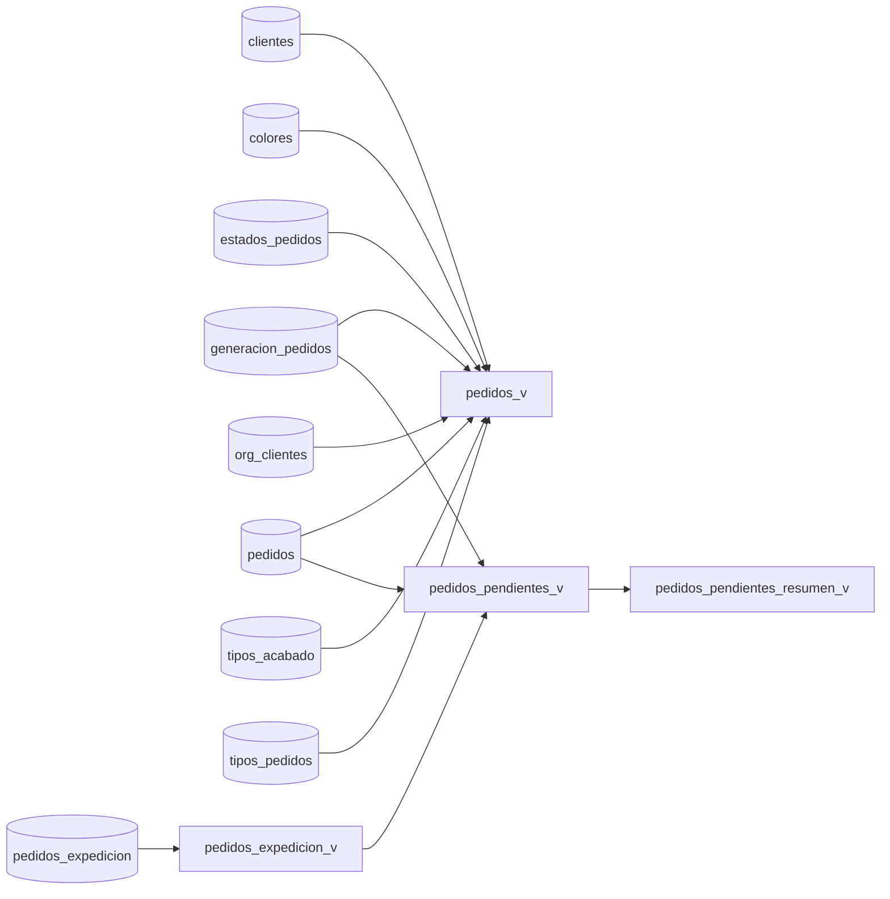
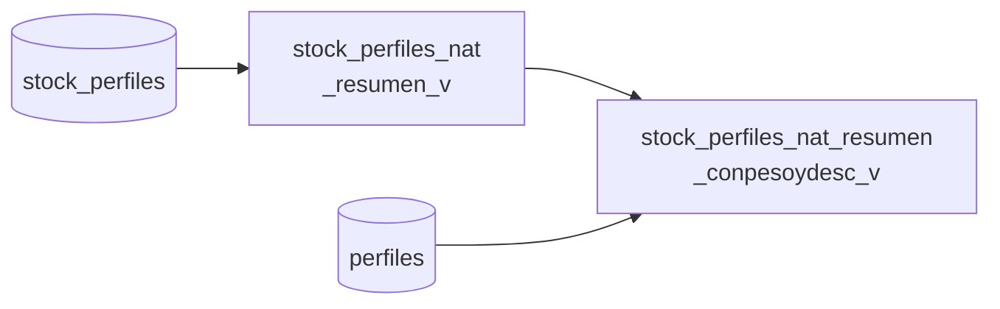
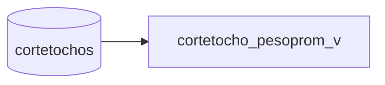
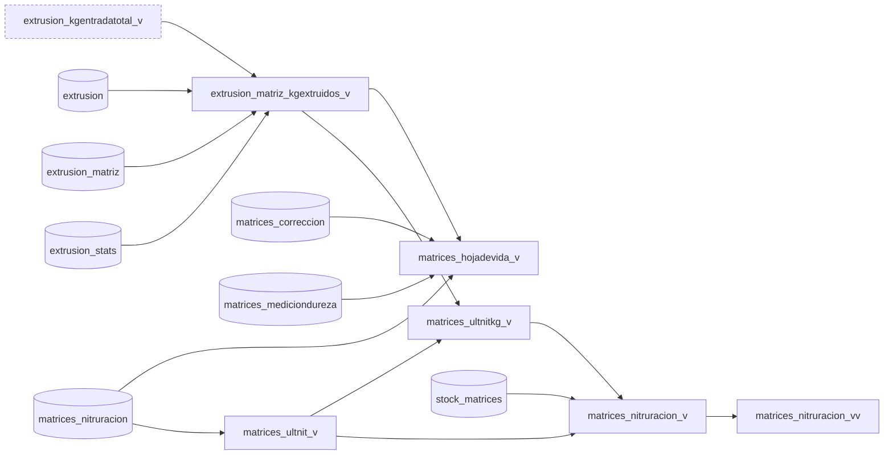
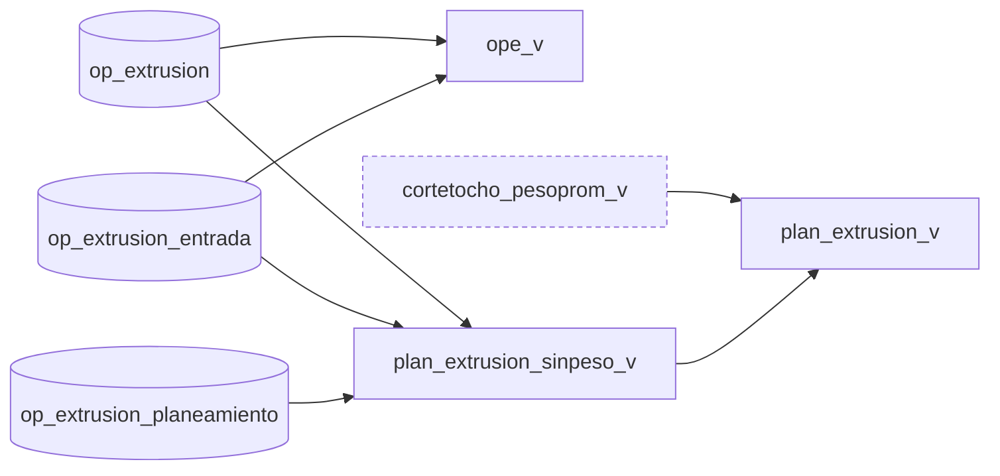
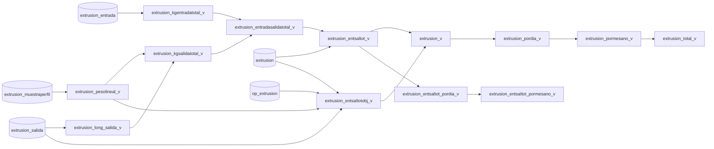
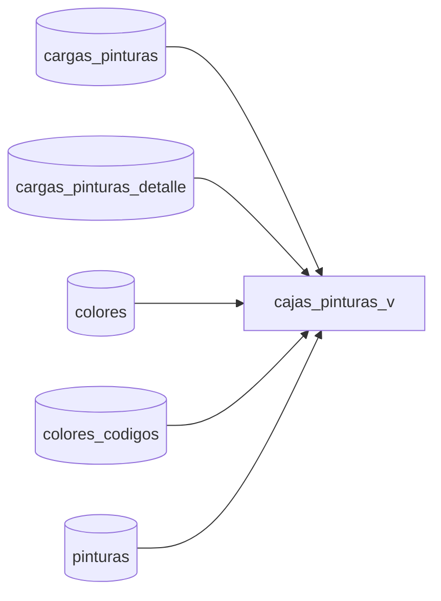

# Views ERD

```mermaid
flowchart BT
  subgraph sg_People_workers_customers_["People (workers & customers)"]
    direction BT
    clientes["<b>clientes</b><br/>int id PK<br/>varchar usuario FK<br/>int id_organizacion FK<br/>varchar nombre<br/>varchar apellido<br/>varchar email<br/>int telefono"]
    org_clientes["<b>org_clientes</b><br/>int id PK<br/>varchar descripcion<br/>int telefono<br/>int telefono2<br/>varchar direccion<br/>varchar ubicacion"]
    rrhh["<b>rrhh</b><br/>int id PK<br/>int id_estado<br/>int nivel<br/>varchar usuario FK<br/>varchar nombre<br/>varchar apellido<br/>int ci<br/>date fecha_nacimiento<br/>varchar direccion<br/>varchar ubicacion<br/>varchar barrio<br/>varchar ciudad<br/>varchar nro_celular<br/>varchar nro_contactourgencia<br/>varchar relacion_contactourgencia<br/>int id_marcador"]
    usuarios["<b>usuarios</b><br/>varchar id PK<br/>varchar clave<br/>tinyint es_rrhh<br/>tinyint es_cliente<br/>tinyint es_delgrupo<br/>tinyint es_admin"]
  end
  subgraph sg_Orders["Orders"]
    direction BT
    estados_pedidos["<b>estados_pedidos</b><br/>int id PK<br/>varchar descripcion"]
    generacion_pedidos["<b>generacion_pedidos</b><br/>int nro_pedido PK<br/>int id_cliente FK<br/>int id_rrhh FK<br/>date fecha_recepcion<br/>time hora_recepcion<br/>varchar id_pedido_seguncliente<br/>varchar obra_uso<br/>text comentarios"]
    pedidos["<b>pedidos</b><br/>int nro_pedido PK,FK<br/>int nro_subpedido PK<br/>int id_tipo_pedido FK<br/>tinyint es_recibidoparapintar<br/>varchar codigo FK<br/>decimal long__m<br/>int id_tipo_acabado FK<br/>int id_color FK<br/>float cantidad<br/>int id_prioridad<br/>int id_estado FK"]
    pedidos_expedicion["<b>pedidos_expedicion</b><br/>int nro_pedido FK<br/>int nro_subpedido FK<br/>date fecha<br/>time hora<br/>int cant_perfiles"]
    tipos_acabado["<b>tipos_acabado</b><br/>int id PK<br/>char descripcion"]
    tipos_pedidos["<b>tipos_pedidos</b><br/>int id PK<br/>char descripcion<br/>varchar unidad"]
    s_pedidos["<b>s_pedidos</b><br/>int _csv_row PK<br/>int nro_pedido<br/>int nro_subpedido<br/>int id_tipo_pedido<br/>tinyint es_recibidoparapintar<br/>varchar codigo<br/>decimal long__m<br/>int id_tipo_acabado<br/>int id_color<br/>float cantidad<br/>int id_prioridad<br/>int id_estado"]
    s_pedidos_expedicion["<b>s_pedidos_expedicion</b><br/>int _csv_row PK<br/>int nro_pedido<br/>int nro_subpedido<br/>date fecha<br/>time hora<br/>int cant_perfiles"]
    pedidos_v(["pedidos_v"])
    pedidos_expedicion_v(["pedidos_expedicion_v"])
    pedidos_pendientes_v(["pedidos_pendientes_v"])
    pedidos_pendientes_resumen_v(["pedidos_pendientes_resumen_v"])
  end
  subgraph sg_Profile_types_and_stock["Profile types and stock"]
    direction BT
    perfiles["<b>perfiles</b><br/>varchar codigo PK<br/>varchar descripcion<br/>int id_tipo FK<br/>float pesolinealnominal__kg_m<br/>float perimetro__mm<br/>float area__mm2<br/>varchar codigo_externo<br/>tinyint es_extrusable"]
    tipos_perfiles["<b>tipos_perfiles</b><br/>int id PK<br/>char descripcion"]
    stock_contenedores_perfiles["<b>stock_contenedores_perfiles</b><br/>int id_tipo_contenedor PK,FK<br/>int id_contenedor PK"]
    tipos_contenedores_perfiles["<b>tipos_contenedores_perfiles</b><br/>int id PK<br/>char descripcion<br/>char abreviatura"]
    d_stock_perfiles["<b>d_stock_perfiles</b><br/>int id PK<br/>date fecha<br/>time hora<br/>int id_rrhh FK<br/>int id_tipo_contenedor_origen FK<br/>int id_contenedor_origen FK<br/>int id_tipo_contenedor_destino FK<br/>int id_contenedor_destino FK<br/>varchar cod_perfil FK<br/>decimal long_perfil__m<br/>tinyint es_envejecido<br/>int id_tipo_acabado FK<br/>int id_color FK<br/>tinyint es_defectuoso<br/>int cantidad<br/>int nro_extrusion FK<br/>int nro_envejecimiento FK<br/>int nro_pintura FK<br/>int id_impresion_etiq<br/>varchar comentario<br/>tinyint es_fix"]
    stock_perfiles["<b>stock_perfiles</b><br/>int id_tipo_contenedor PK,FK<br/>int id_contenedor PK,FK<br/>varchar cod_perfil PK,FK<br/>decimal long_perfil__m PK<br/>tinyint es_envejecido PK<br/>int id_tipo_acabado PK,FK<br/>int id_color PK,FK<br/>tinyint es_defectuoso PK<br/>int cantidad"]
    s_perfiles["<b>s_perfiles</b><br/>int _csv_row PK<br/>varchar codigo<br/>varchar descripcion<br/>int id_tipo<br/>float pesolinealnominal__kg_m<br/>float perimetro__mm<br/>float area__mm2<br/>varchar codigo_externo<br/>tinyint es_extrusable"]
    stock_perfiles_nat_resumen_v(["stock_perfiles_nat_resumen_v"])
    stock_perfiles_nat_resumen_conpesoydesc_v(["stock_perfiles_nat_resumen_conpesoydesc_v"])
  end
  subgraph sg_Extrusion_Materials["Extrusion Materials"]
    direction BT
    cargas_aluminio["<b>cargas_aluminio</b><br/>int nro_carga PK<br/>int id_proveedor_aluminio FK<br/>date fecha_recepcion"]
    cargas_aluminio_detalle["<b>cargas_aluminio_detalle</b><br/>int nro_carga PK,FK<br/>int nro_bulto PK<br/>varchar nro_produccion<br/>varchar aleacion<br/>int cant_tocho0<br/>decimal long_tocho0__cm<br/>float peso_neto__kg<br/>float peso_bruto__kg"]
    tocho0["<b>tocho0</b><br/>int nro PK<br/>int nro_carga FK<br/>int nro_bulto FK"]
  end
  subgraph sg_Billets_cutting["Billets & cutting"]
    direction BT
    cortetochos["<b>cortetochos</b><br/>int nro PK<br/>int nro_op FK<br/>int nro_subop FK<br/>date fecha<br/>time hora_inicio<br/>time hora_fin<br/>int id_rrhh FK<br/>int nro_tocho0 FK<br/>decimal long_inicial__cm<br/>decimal long_tocho__cm<br/>int cant_tochos<br/>float pesoprom_tochos__kg<br/>decimal long_final__cm<br/>float peso_resto__kg"]
    s_cortetochos["<b>s_cortetochos</b><br/>int _csv_row PK<br/>int nro<br/>int nro_op<br/>int nro_subop<br/>date fecha<br/>time hora_inicio<br/>time hora_fin<br/>int id_rrhh<br/>int nro_tocho0<br/>decimal long_inicial__cm<br/>decimal long_tocho__cm<br/>int cant_tochos<br/>float pesoprom_tochos__kg<br/>decimal long_final__cm<br/>float peso_resto__kg"]
    cortetocho_pesoprom_v(["cortetocho_pesoprom_v"])
  end
  subgraph sg_Dies["Dies"]
    direction BT
    matrices["<b>matrices</b><br/>varchar codigo PK<br/>int id_tipo FK<br/>varchar cod_perfil FK<br/>int nro_salidas<br/>int id_proveedor<br/>tinyint es_fragil"]
    matrices_correccion["<b>matrices_correccion</b><br/>int fecha<br/>int id_rrhh FK<br/>varchar cod_matriz FK<br/>int nro_serie_matriz FK<br/>text descripcion"]
    matrices_mediciondureza["<b>matrices_mediciondureza</b><br/>date fecha<br/>int id_rrhh FK<br/>varchar cod_matriz FK<br/>int nro_serie_matriz FK<br/>float dureza__rhc"]
    matrices_nitruracion["<b>matrices_nitruracion</b><br/>date fecha_salida<br/>date fecha_retorno<br/>int id_rrhh_salida FK<br/>int id_rrhh_retorno FK<br/>varchar cod_matriz FK<br/>int nro_serie_matriz FK"]
    nitruracion_kgmax["<b>nitruracion_kgmax</b><br/>int nro_nitruraciones PK<br/>tinyint es_fragil PK<br/>float max__kg PK"]
    stock_matrices["<b>stock_matrices</b><br/>varchar cod_matriz PK,FK<br/>int nro_serie PK<br/>varchar grabado"]
    tipos_matrices["<b>tipos_matrices</b><br/>int id PK<br/>char descripcion"]
    s_matrices_correccion["<b>s_matrices_correccion</b><br/>int _csv_row PK<br/>int fecha<br/>int id_rrhh<br/>varchar cod_matriz<br/>int nro_serie_matriz<br/>text descripcion"]
    s_matrices_mediciondureza["<b>s_matrices_mediciondureza</b><br/>int _csv_row PK<br/>date fecha<br/>int id_rrhh<br/>varchar cod_matriz<br/>int nro_serie_matriz<br/>float dureza__rhc"]
    s_matrices_nitruracion["<b>s_matrices_nitruracion</b><br/>int _csv_row PK<br/>date fecha_salida<br/>date fecha_retorno<br/>int id_rrhh_salida<br/>int id_rrhh_retorno<br/>varchar cod_matriz<br/>int nro_serie_matriz"]
    extrusion_matriz_kgextruidos_v(["extrusion_matriz_kgextruidos_v"])
    matrices_hojadevida_v(["matrices_hojadevida_v"])
    matrices_ultnit_v(["matrices_ultnit_v"])
    matrices_ultnitkg_v(["matrices_ultnitkg_v"])
    matrices_nitruracion_v(["matrices_nitruracion_v"])
    matrices_nitruracion_vv(["matrices_nitruracion_vv"])
  end
  subgraph sg_Extrusion_orders["Extrusion orders"]
    direction BT
    generacion_op_extrusion["<b>generacion_op_extrusion</b><br/>int nro_op PK<br/>date fecha<br/>int id_rrhh FK"]
    op_extrusion["<b>op_extrusion</b><br/>int nro_op PK,FK<br/>int nro_subop PK<br/>varchar cod_perfil FK<br/>decimal long_perfil__m<br/>int cant_perfil_min<br/>int id_estado"]
    op_extrusion_entrada["<b>op_extrusion_entrada</b><br/>int nro_op PK,FK<br/>int nro_subop PK,FK<br/>decimal long_tocho__cm PK<br/>int cant_tochos<br/>int cant_tochosporcorte<br/>float posicion_sierracorte<br/>int id_proveedor_aluminio FK"]
    op_extrusion_matriz["<b>op_extrusion_matriz</b><br/>int nro_op FK<br/>int nro_subop FK<br/>varchar cod_matriz FK<br/>int nro_serie_matriz FK"]
    s_op_extrusion_matriz["<b>s_op_extrusion_matriz</b><br/>int _csv_row PK<br/>int nro_op<br/>int nro_subop<br/>varchar cod_matriz<br/>int nro_serie_matriz"]
    op_extrusion_objetivo["<b>op_extrusion_objetivo</b><br/>int nro_op PK,FK<br/>int nro_subop PK,FK<br/>float long_mesa_objetivo__m<br/>int cant_perfil_objetivo<br/>float salida_objetivo__kg"]
    op_extrusion_parapedido["<b>op_extrusion_parapedido</b><br/>int nro_op PK,FK<br/>int nro_subop PK,FK<br/>int nro_pedido PK,FK<br/>int nro_subpedido PK,FK"]
    op_extrusion_planeamiento["<b>op_extrusion_planeamiento</b><br/>int nro_op FK<br/>int nro_subop FK<br/>float fraccion_entrada<br/>date fecha_planeada<br/>int orden"]
    s_op_extrusion_parapedido["<b>s_op_extrusion_parapedido</b><br/>int _csv_row PK<br/>int nro_op<br/>int nro_subop<br/>int nro_pedido<br/>int nro_subpedido"]
    ope_v(["ope_v"])
    plan_extrusion_sinpeso_v(["plan_extrusion_sinpeso_v"])
    plan_extrusion_v(["plan_extrusion_v"])
  end
  subgraph sg_Extrusion_production["Extrusion production"]
    direction BT
    extrusion["<b>extrusion</b><br/>int nro PK<br/>date fecha<br/>time hora_inicio<br/>time hora_fin<br/>int id_rrhh FK<br/>int nro_op FK<br/>int nro_subop FK<br/>varchar cod_perfil FK"]
    extrusion_corte["<b>extrusion_corte</b><br/>int nro_extrusion FK<br/>date fecha<br/>time hora_inicio<br/>time hora_fin<br/>int id_rrhh_1 FK<br/>int id_rrhh_2 FK"]
    extrusion_entrada["<b>extrusion_entrada</b><br/>int nro_extrusion PK,FK<br/>decimal long_tocho__cm PK<br/>float peso_unit__kg PK<br/>int cantidad PK"]
    extrusion_matriz["<b>extrusion_matriz</b><br/>int nro_extrusion PK,FK<br/>varchar cod_matriz FK<br/>int nro_serie_matriz FK"]
    extrusion_muestraculote["<b>extrusion_muestraculote</b><br/>int nro_extrusion FK<br/>int cant_culote<br/>float peso_total__kg"]
    extrusion_muestraperfil["<b>extrusion_muestraperfil</b><br/>int nro_extrusion FK<br/>int nro_salida<br/>decimal long_muestraperfil__cm<br/>float peso_muestra__g"]
    extrusion_salida["<b>extrusion_salida</b><br/>int nro_extrusion FK<br/>decimal long_perfil__m<br/>int cantidad<br/>int id_tipo_contenedor FK<br/>int id_contenedor FK"]
    extrusion_stats["<b>extrusion_stats</b><br/>int nro_extrusion PK,FK<br/>tinyint es_prueba<br/>float pos_sierracorte<br/>float long_mesa__m<br/>float temp_tocho_entrada__c<br/>float temp_perfil_salida__c<br/>tinyint sugiere_correccion_matriz<br/>tinyint extrusion_detenida<br/>text comentarios"]
    s_extrusion["<b>s_extrusion</b><br/>int _csv_row PK<br/>int nro<br/>date fecha<br/>time hora_inicio<br/>time hora_fin<br/>int id_rrhh<br/>int nro_op<br/>int nro_subop<br/>varchar cod_perfil"]
    s_extrusion_corte["<b>s_extrusion_corte</b><br/>int _csv_row PK<br/>int nro_extrusion<br/>date fecha<br/>time hora_inicio<br/>time hora_fin"]
    s_extrusion_entrada["<b>s_extrusion_entrada</b><br/>int _csv_row PK<br/>int nro_extrusion<br/>decimal long_tocho__cm<br/>int cantidad<br/>float peso_unit__kg"]
    s_extrusion_matriz["<b>s_extrusion_matriz</b><br/>int _csv_row PK<br/>int nro_extrusion<br/>varchar cod_matriz<br/>int nro_serie_matriz"]
    s_extrusion_muestraculote["<b>s_extrusion_muestraculote</b><br/>int _csv_row PK<br/>int nro_extrusion<br/>int cant_culote<br/>float peso_total__kg"]
    s_extrusion_muestraperfil["<b>s_extrusion_muestraperfil</b><br/>int _csv_row PK<br/>int nro_extrusion<br/>int nro_salida<br/>decimal long_muestraperfil__cm<br/>float peso_muestra__g"]
    s_extrusion_salida["<b>s_extrusion_salida</b><br/>int _csv_row PK<br/>int nro_extrusion<br/>decimal long_perfil__m<br/>int cantidad<br/>int id_tipo_contenedor<br/>int id_contenedor"]
    s_extrusion_stats["<b>s_extrusion_stats</b><br/>int _csv_row PK<br/>int nro_extrusion<br/>tinyint es_prueba<br/>float pos_sierracorte<br/>float long_mesa__m<br/>float temp_tocho_entrada__c<br/>float temp_perfil_salida__c<br/>tinyint sugiere_correccion_matriz<br/>tinyint extrusion_detenida<br/>text comentarios"]
    extrusion_kgentradatotal_v(["extrusion_kgentradatotal_v"])
    extrusion_pesolineal_v(["extrusion_pesolineal_v"])
    extrusion_long_salida_v(["extrusion_long_salida_v"])
    extrusion_kgsalidatotal_v(["extrusion_kgsalidatotal_v"])
    extrusion_entradasalidatotal_v(["extrusion_entradasalidatotal_v"])
    extrusion_entsaltot_v(["extrusion_entsaltot_v"])
    extrusion_entsaltotobj_v(["extrusion_entsaltotobj_v"])
    extrusion_v(["extrusion_v"])
    extrusion_pordia_v(["extrusion_pordia_v"])
    extrusion_pormesano_v(["extrusion_pormesano_v"])
    extrusion_total_v(["extrusion_total_v"])
    extrusion_entsaltot_pordia_v(["extrusion_entsaltot_pordia_v"])
    extrusion_entsaltot_pormesano_v(["extrusion_entsaltot_pormesano_v"])
  end
  subgraph sg_Aging["Aging"]
    direction BT
    envejecimiento["<b>envejecimiento</b><br/>int nro PK<br/>date fecha_inicio<br/>time hora_inicio<br/>int id_rrhh_inicio FK<br/>date fecha_fin<br/>time hora_fin<br/>int id_rrhh_fin FK"]
    envejecimiento_canastos["<b>envejecimiento_canastos</b><br/>int nro_canasto<br/>int nro_envejecimiento FK<br/>int id_tipo_contenedor FK<br/>int id_contenedor FK"]
    envejecimiento_canastos_detalle["<b>envejecimiento_canastos_detalle</b><br/>int nro_canasto FK<br/>varchar cod_perfil FK<br/>decimal long_perfil__m<br/>int cantidad<br/>int nro_op FK<br/>int nro_subop FK"]
    s_envejecimiento_canastos["<b>s_envejecimiento_canastos</b><br/>int _csv_row PK<br/>int nro_canasto<br/>int nro_envejecimiento<br/>int id_tipo_contenedor<br/>int id_contenedor"]
    s_envejecimiento_canastos_detalle["<b>s_envejecimiento_canastos_detalle</b><br/>int _csv_row PK<br/>int nro_canasto<br/>varchar cod_perfil<br/>decimal long_perfil__m<br/>int cantidad<br/>int nro_op<br/>int nro_subop"]
  end
  subgraph sg_Paint_Materials_and_Supplies["Paint Materials and Supplies"]
    direction BT
    cargas_pinturas["<b>cargas_pinturas</b><br/>int nro_carga PK<br/>int id_proveedor_pintura<br/>date fecha_recepcion<br/>int nro_remision<br/>int nro_factura<br/>text comentarios"]
    cargas_pinturas_detalle["<b>cargas_pinturas_detalle</b><br/>int nro_carga PK,FK<br/>int nro_subcarga PK<br/>varchar cod_pintura_proveedor FK<br/>varchar lote<br/>date fecha_elaboracion<br/>date fecha_vencimiento"]
    colores["<b>colores</b><br/>int id PK<br/>char abreviatura<br/>char descripcion"]
    colores_codigos["<b>colores_codigos</b><br/>varchar cod_pintura_proveedor PK<br/>varchar desc_proveedor<br/>int id_color FK<br/>int id_proveedor PK,FK<br/>int id_marca FK"]
    marcas["<b>marcas</b><br/>int id PK<br/>varchar descripcion"]
    pinturas["<b>pinturas</b><br/>int nro_caja PK<br/>int nro_carga FK<br/>int nro_subcarga FK"]
    proveedores["<b>proveedores</b><br/>int id PK<br/>varchar descripcion<br/>int id_tipo FK<br/>text otros_datos"]
    tipos_proveedores["<b>tipos_proveedores</b><br/>int id PK<br/>varchar descripcion"]
    d_stock_pinturas["<b>d_stock_pinturas</b><br/>int id PK<br/>date fecha<br/>time hora<br/>int id_rrhh FK<br/>int nro_caja FK<br/>int d_cantidad<br/>int nro_pedidointerno<br/>tinyint es_fix"]
    stock_pinturas["<b>stock_pinturas</b><br/>int nro_caja FK"]
    s_pinturas["<b>s_pinturas</b><br/>int _csv_row PK<br/>int nro_caja<br/>int nro_carga<br/>int nro_subcarga"]
    s_d_stock_pinturas["<b>s_d_stock_pinturas</b><br/>int _csv_row PK<br/>date fecha<br/>time hora<br/>int id_rrhh<br/>int nro_caja<br/>int d_cantidad<br/>int nro_pedidointerno<br/>tinyint es_fix"]
    cajas_pinturas_v(["cajas_pinturas_v"])
  end
  subgraph sg_Painting_orders["Painting orders"]
    direction BT
    estados_op_pintura["<b>estados_op_pintura</b><br/>int id PK<br/>varchar descripcion"]
    generacion_op_pintura["<b>generacion_op_pintura</b><br/>int nro_op PK<br/>int id_color FK<br/>date fecha<br/>int id_rrhh FK"]
    op_pintura["<b>op_pintura</b><br/>int nro_op PK,FK<br/>int nro_subop PK<br/>varchar codigo FK<br/>decimal long__m<br/>int cantidad<br/>int id_estado FK"]
    op_pintura_parapedido["<b>op_pintura_parapedido</b><br/>int nro_op PK,FK<br/>int nro_subop PK,FK<br/>int nro_pedido PK,FK<br/>int nro_subpedido PK,FK"]
    op_pintura_planeamiento["<b>op_pintura_planeamiento</b><br/>int nro_op FK<br/>int nro_subop FK<br/>float fraccion_entrada<br/>date fecha_planeada<br/>int orden"]
    s_op_pintura_parapedido["<b>s_op_pintura_parapedido</b><br/>int _csv_row PK<br/>int nro_op<br/>int nro_subop<br/>int nro_pedido<br/>int nro_subpedido"]
  end
  subgraph sg_Painting_production["Painting production"]
    direction BT
    pintura["<b>pintura</b><br/>int nro PK<br/>int nro_op<br/>int nro_subop<br/>int id_color FK<br/>date fecha<br/>time hora_inicio<br/>time hora_fin<br/>int id_rrhh FK<br/>float velocidad_monovia<br/>int cant_porganchera<br/>varchar codigo<br/>float long__m<br/>int cantidad"]
  end
  subgraph sg_Diagnostics["Diagnostics (cross-cutting)"]
    direction BT
    load_errors_v(["load_errors_v"])
  end

  clientes -->|"as user"| usuarios
  clientes -->|"belongs to org"| org_clientes
  rrhh -->|"as user"| usuarios
  cargas_aluminio -->|"supplied by"| proveedores
  cargas_aluminio_detalle -->|"from load"| cargas_aluminio
  cargas_pinturas_detalle -->|"from load"| cargas_pinturas
  cargas_pinturas_detalle -->|"of paint code"| colores_codigos
  colores_codigos -->|"in color"| colores
  colores_codigos -->|"supplied by"| proveedores
  colores_codigos -->|"of brand"| marcas
  pinturas -->|"from load"| cargas_pinturas_detalle
  proveedores -->|"is type"| tipos_proveedores
  stock_contenedores_perfiles -->|"in container type"| tipos_contenedores_perfiles
  tocho0 -->|"from load"| cargas_aluminio_detalle
  matrices -->|"is type"| tipos_matrices
  matrices -->|"of profile"| perfiles
  matrices_correccion -->|"using die"| stock_matrices
  matrices_correccion -->|"recorded by"| rrhh
  matrices_mediciondureza -->|"using die"| stock_matrices
  matrices_mediciondureza -->|"recorded by"| rrhh
  matrices_nitruracion -->|"using die"| stock_matrices
  matrices_nitruracion -->|"sent out by"| rrhh
  matrices_nitruracion -->|"returned by"| rrhh
  perfiles -->|"is type"| tipos_perfiles
  stock_matrices -->|"using die"| matrices
  generacion_pedidos -->|"recorded by"| rrhh
  generacion_pedidos -->|"requested by"| clientes
  pedidos -->|"for order"| generacion_pedidos
  pedidos -->|"of profile"| perfiles
  pedidos -->|"is type"| tipos_pedidos
  pedidos -->|"has finish"| tipos_acabado
  pedidos -->|"in color"| colores
  pedidos -->|"has status"| estados_pedidos
  pedidos_expedicion -->|"for order"| pedidos
  generacion_op_extrusion -->|"recorded by"| rrhh
  op_extrusion -->|"for op"| generacion_op_extrusion
  op_extrusion -->|"of profile"| perfiles
  op_extrusion_entrada -->|"for op"| op_extrusion
  op_extrusion_entrada -->|"supplied by"| proveedores
  op_extrusion_matriz -->|"for op"| op_extrusion
  op_extrusion_matriz -->|"using die"| stock_matrices
  op_extrusion_objetivo -->|"for op"| op_extrusion
  op_extrusion_parapedido -->|"for op"| op_extrusion
  op_extrusion_parapedido -->|"for order"| pedidos
  op_extrusion_planeamiento -->|"for op"| op_extrusion
  generacion_op_pintura -->|"in color"| colores
  generacion_op_pintura -->|"recorded by"| rrhh
  op_pintura -->|"for op"| generacion_op_pintura
  op_pintura -->|"of profile"| perfiles
  op_pintura -->|"has status"| estados_op_pintura
  op_pintura_parapedido -->|"for op"| op_pintura
  op_pintura_parapedido -->|"for order"| pedidos
  op_pintura_planeamiento -->|"for op"| op_pintura
  cortetochos -->|"of billet"| tocho0
  cortetochos -->|"for op"| op_extrusion
  cortetochos -->|"recorded by"| rrhh
  extrusion -->|"of profile"| perfiles
  extrusion -->|"for op"| op_extrusion
  extrusion -->|"recorded by"| rrhh
  extrusion_corte -->|"from extrusion"| extrusion
  extrusion_corte -->|"cut by (operator 1)"| rrhh
  extrusion_corte -->|"cut by (operator 2)"| rrhh
  extrusion_entrada -->|"from extrusion"| extrusion
  extrusion_matriz -->|"from extrusion"| extrusion
  extrusion_matriz -->|"using die"| stock_matrices
  extrusion_muestraculote -->|"from extrusion"| extrusion
  extrusion_muestraperfil -->|"from extrusion"| extrusion
  extrusion_salida -->|"from extrusion"| extrusion
  extrusion_salida -->|"in container type"| stock_contenedores_perfiles
  extrusion_stats -->|"from extrusion"| extrusion
  envejecimiento -->|"started by"| rrhh
  envejecimiento -->|"ended by"| rrhh
  envejecimiento_canastos -->|"from aging batch"| envejecimiento
  envejecimiento_canastos -->|"in container type"| stock_contenedores_perfiles
  pintura -->|"in color"| colores
  pintura -->|"recorded by"| rrhh

  d_stock_perfiles -->|"recorded by"| rrhh
  d_stock_perfiles -->|"from container"| stock_contenedores_perfiles
  d_stock_perfiles -->|"to container"| stock_contenedores_perfiles
  d_stock_perfiles -->|"of profile"| perfiles
  d_stock_perfiles -->|"has finish"| tipos_acabado
  d_stock_perfiles -->|"in color"| colores
  d_stock_perfiles -->|"from extrusion"| extrusion
  d_stock_perfiles -->|"from aging batch"| envejecimiento
  d_stock_perfiles -->|"from painting run"| pintura
  stock_perfiles -->|"in container"| stock_contenedores_perfiles
  stock_perfiles -->|"of profile"| perfiles
  stock_perfiles -->|"has finish"| tipos_acabado
  stock_perfiles -->|"in color"| colores
  d_stock_pinturas -->|"recorded by"| rrhh
  d_stock_pinturas -->|"of box"| pinturas
  stock_pinturas -->|"of box"| pinturas
  envejecimiento_canastos_detalle -->|"in basket"| envejecimiento_canastos
  envejecimiento_canastos_detalle -->|"of profile"| perfiles
  envejecimiento_canastos_detalle -->|"for op"| op_extrusion


  %% views
  cajas_pinturas_v --> cargas_pinturas
  cajas_pinturas_v --> cargas_pinturas_detalle
  cajas_pinturas_v --> colores
  cajas_pinturas_v --> colores_codigos
  cajas_pinturas_v --> pinturas
  cortetocho_pesoprom_v --> cortetochos
  extrusion_entradasalidatotal_v --> extrusion_kgentradatotal_v
  extrusion_entradasalidatotal_v --> extrusion_kgsalidatotal_v
  extrusion_entsaltot_pordia_v --> extrusion_entsaltot_v
  extrusion_entsaltot_pormesano_v --> extrusion_entsaltot_pordia_v
  extrusion_entsaltot_v --> extrusion
  extrusion_entsaltot_v --> extrusion_entradasalidatotal_v
  extrusion_entsaltotobj_v --> extrusion
  extrusion_entsaltotobj_v --> extrusion_salida
  extrusion_entsaltotobj_v --> op_extrusion
  extrusion_entsaltotobj_v --> extrusion_pesolineal_v
  extrusion_kgentradatotal_v --> extrusion_entrada
  extrusion_kgsalidatotal_v --> extrusion_long_salida_v
  extrusion_kgsalidatotal_v --> extrusion_pesolineal_v
  extrusion_long_salida_v --> extrusion_salida
  extrusion_matriz_kgextruidos_v --> extrusion
  extrusion_matriz_kgextruidos_v --> extrusion_matriz
  extrusion_matriz_kgextruidos_v --> extrusion_stats
  extrusion_matriz_kgextruidos_v --> extrusion_kgentradatotal_v
  extrusion_pesolineal_v --> extrusion_muestraperfil
  extrusion_pordia_v --> extrusion_v
  extrusion_pormesano_v --> extrusion_pordia_v
  extrusion_total_v --> extrusion_pormesano_v
  extrusion_v --> extrusion_entsaltot_v
  extrusion_v --> extrusion_entsaltotobj_v
  matrices_hojadevida_v --> matrices_correccion
  matrices_hojadevida_v --> matrices_mediciondureza
  matrices_hojadevida_v --> matrices_nitruracion
  matrices_hojadevida_v --> extrusion_matriz_kgextruidos_v
  matrices_nitruracion_v --> stock_matrices
  matrices_nitruracion_v --> matrices_ultnit_v
  matrices_nitruracion_v --> matrices_ultnitkg_v
  matrices_nitruracion_vv --> matrices_nitruracion_v
  matrices_ultnit_v --> matrices_nitruracion
  matrices_ultnitkg_v --> extrusion_matriz_kgextruidos_v
  matrices_ultnitkg_v --> matrices_ultnit_v
  ope_v --> op_extrusion
  ope_v --> op_extrusion_entrada
  pedidos_expedicion_v --> pedidos_expedicion
  pedidos_pendientes_resumen_v --> pedidos_pendientes_v
  pedidos_pendientes_v --> generacion_pedidos
  pedidos_pendientes_v --> pedidos
  pedidos_pendientes_v --> pedidos_expedicion_v
  pedidos_v --> clientes
  pedidos_v --> colores
  pedidos_v --> estados_pedidos
  pedidos_v --> generacion_pedidos
  pedidos_v --> org_clientes
  pedidos_v --> pedidos
  pedidos_v --> tipos_acabado
  pedidos_v --> tipos_pedidos
  plan_extrusion_sinpeso_v --> op_extrusion
  plan_extrusion_sinpeso_v --> op_extrusion_entrada
  plan_extrusion_sinpeso_v --> op_extrusion_planeamiento
  plan_extrusion_v --> cortetocho_pesoprom_v
  plan_extrusion_v --> plan_extrusion_sinpeso_v
  stock_perfiles_nat_resumen_conpesoydesc_v --> perfiles
  stock_perfiles_nat_resumen_v --> stock_perfiles
  stock_perfiles_nat_resumen_conpesoydesc_v --> stock_perfiles_nat_resumen_v
  stock_perfiles_nat_resumen_conpesoydesc_v --> perfiles

  style sg_People_workers_customers_ fill:none,stroke:#c9a227,stroke-width:2px
  style sg_Orders fill:none,stroke:#4c7fa3,stroke-width:2px
  style sg_Profile_types_and_stock fill:none,stroke:#6a8f5c,stroke-width:2px
  style sg_Extrusion_Materials fill:none,stroke:#b05a6a,stroke-width:2px
  style sg_Billets_cutting fill:none,stroke:#8a5fb0,stroke-width:2px
  style sg_Dies fill:none,stroke:#b0795f,stroke-width:2px
  style sg_Extrusion_orders fill:none,stroke:#5fa0a0,stroke-width:2px
  style sg_Extrusion_production fill:none,stroke:#a05f8a,stroke-width:2px
  style sg_Aging fill:none,stroke:#8a9282,stroke-width:2px
  style sg_Paint_Materials_and_Supplies fill:none,stroke:#c9922a,stroke-width:2px
  style sg_Painting_orders fill:none,stroke:#5f7fb0,stroke-width:2px
  style sg_Painting_production fill:none,stroke:#b05f5f,stroke-width:2px
  style sg_Diagnostics fill:none,stroke:#888888,stroke-width:2px,stroke-dasharray: 4 3

  classDef view fill:#eaf7ea,stroke:#3f8f5f,stroke-width:1.5px,color:#1f4d33
  class pedidos_v,pedidos_expedicion_v,pedidos_pendientes_v,pedidos_pendientes_resumen_v,stock_perfiles_nat_resumen_v,stock_perfiles_nat_resumen_conpesoydesc_v,cortetocho_pesoprom_v,extrusion_matriz_kgextruidos_v,matrices_hojadevida_v,matrices_ultnit_v,matrices_ultnitkg_v,matrices_nitruracion_v,matrices_nitruracion_vv,ope_v,plan_extrusion_sinpeso_v,plan_extrusion_v,extrusion_kgentradatotal_v,extrusion_pesolineal_v,extrusion_long_salida_v,extrusion_kgsalidatotal_v,extrusion_entradasalidatotal_v,extrusion_entsaltot_v,extrusion_entsaltotobj_v,extrusion_v,extrusion_pordia_v,extrusion_pormesano_v,extrusion_total_v,extrusion_entsaltot_pordia_v,extrusion_entsaltot_pormesano_v,cajas_pinturas_v,load_errors_v view
```


- **Solid box** — a view that belongs to this group.
- **Dashed box** — a view that belongs to a different group (see its own section there; full
  detail is only shown once, to avoid repeating the same box in two diagrams).
- **Cylinder** — a base table (see [tables.md](./tables.md)).

## Orders

4 views in this group, plus 9 base tables.



## Profile types and stock

2 views in this group, plus 2 base tables.



## Billets & cutting

1 view in this group, plus 1 base table.



## Dies

6 views in this group, plus 1 view from other groups and 7 base tables.



## Extrusion orders

3 views in this group, plus 1 view from other groups and 3 base tables.



## Extrusion production

13 views in this group, plus 5 base tables.



## Paint Materials and Supplies

1 view in this group, plus 5 base tables.


